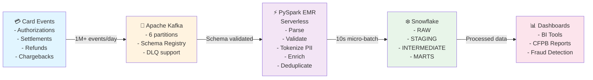
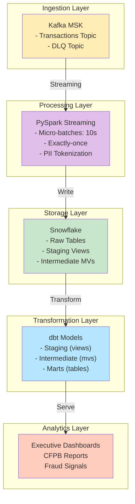
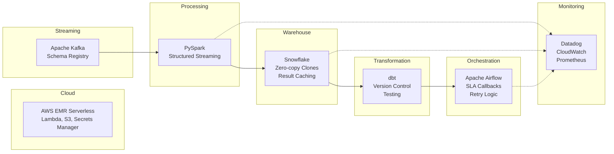
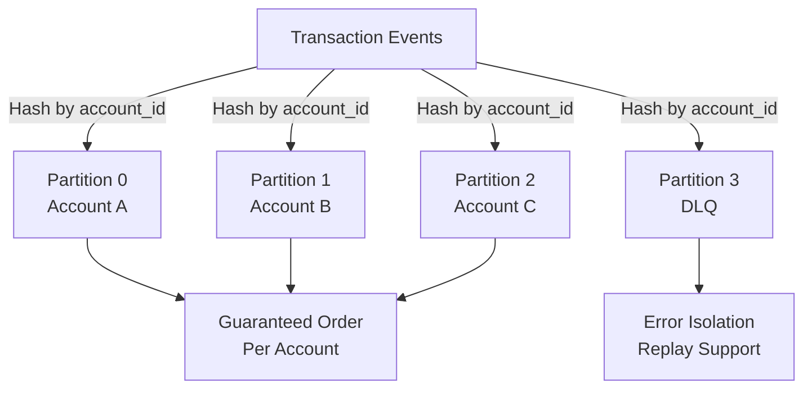
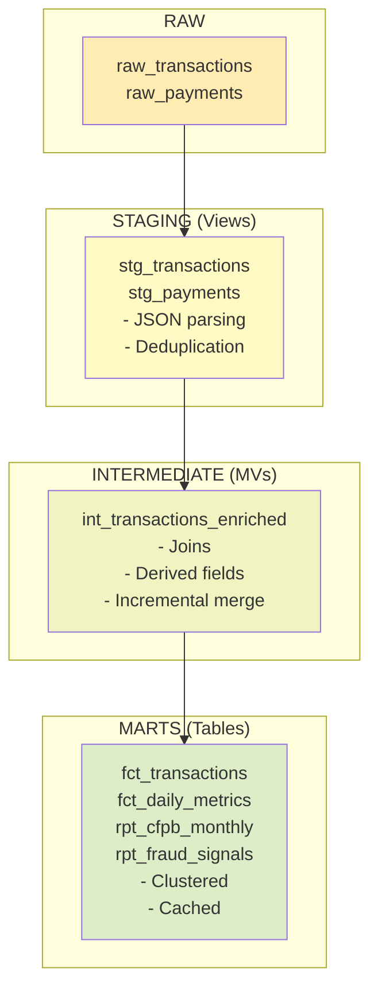
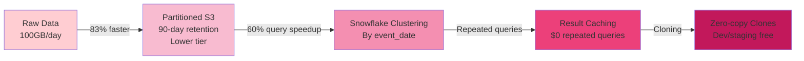
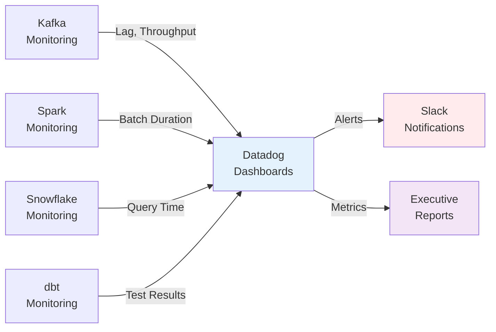

# Real-Time Fintech Pipeline - Architecture Diagrams

## System Flow

## Data Flow Layers

## Technology Stack

## Kafka Partitioning Strategy

## dbt Transformation Layers

## Cost Optimization Flow

## SLA and Monitoring

